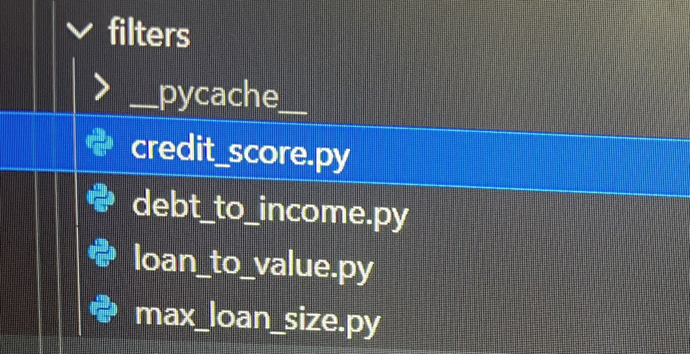

# *Loan Qualifier App*


*Overall this app determines if you qualify for a loan by iterating through data and performing numerous calculation.This is made easy for the user and companies.Clients can see which banks are right for them once applications is filled out digitally.*
```
New updates allowed the ability to prompt the user to save qualifying loans as a new csv file enhancing user experience..
```
>*As high priority feature request
emerge more updates will continuously arise enhancing the user experience*
---


## Technologies
  `Iterating to create an approval list`
 
 *This app is built and excuted using `Python version 3.10`*
*Iterating through the csv file allows this program to*
**gather and store data.**

```Python
credit_score_approval_list = []
    for bank in bank_list:
        if credit_score >= int(bank[4]):
            credit_score_approval_list.append(bank)
    return credit_score_approval_list 
 ```
 *Using the `For` condiational statement it allow us to iterate through the csv file known as bank_list* **nested** *in the `For` statement is a `If` statement which tells the computer if the credit score is greater or equal to the bank min approval credit score* *then **append** the bank to a list called credit_score_approval_list.*
 
 >During this process the computer is giving more specific instruction when iterating `int(bank[4])`
 
  
  *This specifically tells the computer to iterate bank[4]* **which is all the bank min credit score this information is givin through the csv file**
 
  ```Python
  int is a function in python because we are getting information through a csv file the number is technically a `string` using int() its coverted to a integer 
  ```
  >If iteration contains decimals such as 0.67 use a `float()`to convert string to float.
  
  `Created Four approval list`

[Credit_score](pics\creditscore.png)

[Debt_to_income](pics\debt_to_income.png)

[Loan_to_value](pics\loan_to_value.png)

[Max_loan_size](pics\max_loan.png)

>This uses the same iteration that specifically target each of them and create a seperate list for each of them that **make up bank_data_filter**

`Libraries`

*Through out this project several Python library are use to access different function whithin its library these libraries are*

[Fire](https://google.github.io/python-fire/guide/)

[Questionary](https://libraries.io/pypi/questionary)

> Fire version `0.4.0` and Questionary version `1.10.0` was used in this project


[Csv](https://docs.python.org/3/library/csv.html)

[Sys](https://www.geeksforgeeks.org/python-sys-module/)

[Pathlib](https://www.geeksforgeeks.org/pathlib-module-in-python/#:~:text=Pathlib%20module%20in%20Python%20provides%20various%20classes%20representing,paths%20provides%20computational%20as%20well%20as%20I%2FO%20operations.)

> All libraries are up to date working with **Python version** `3.10`

`Modules`

*Through out this project several Modules are use to access different functions organized in folders*
```Python
The filter folder contain four modules known as the approval_list each containing there own specific iteration to store specific data
```

```Python
The utils folder contain two modules one being for calculation and the other is to load csv
```


`each module is imported to main py file`
>Easier to pinpoint problems and more organized being more modularize

---

## Installation Guide

In this section, you should include detailed installation notes containing code blocks and screenshots.

---

## Usage

This section should include screenshots, code blocks, or animations explaining how to use your project.

---

## Contributors

In this section, list all the people who contribute to this project. You might want recruiters or potential collaborators to reach you, so include your contact email and, optionally, your LinkedIn or Twitter profile.

---

## License

When you share a project on a repository, especially a public one, it's important to choose the right license to specify what others can and can't with your source code and files. Use this section to include the license you want to use.
