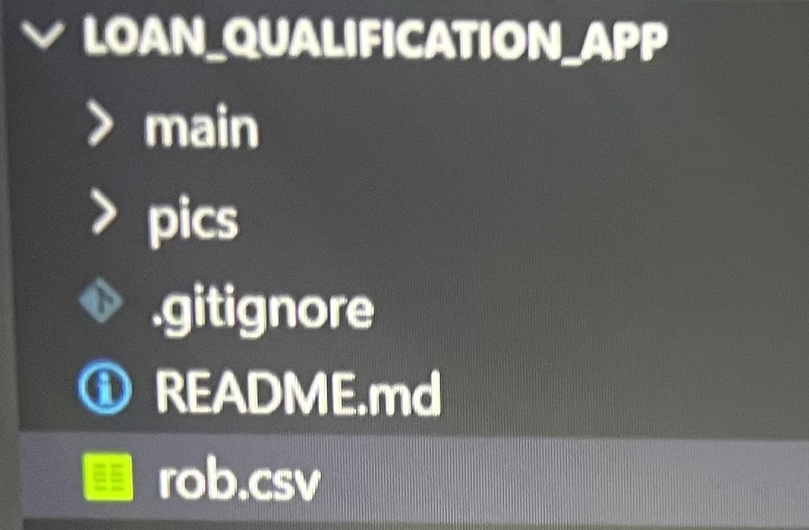
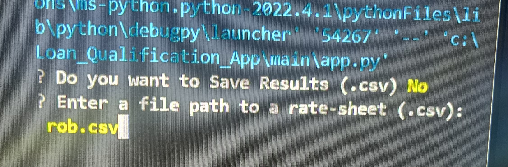
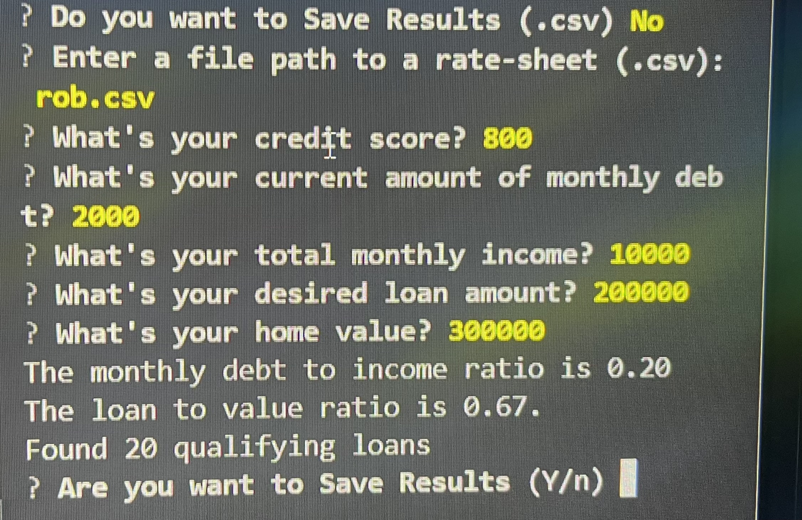
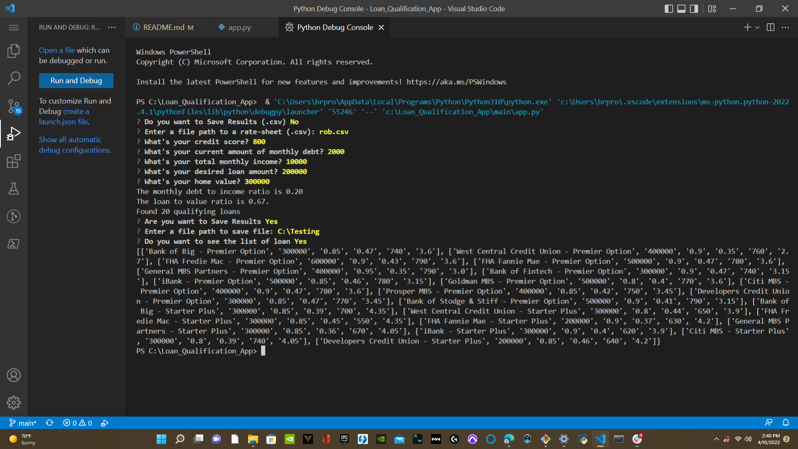

# *Loan Qualifier App*


*Overall this app determines if you qualify for a loan by iterating through data and performing numerous calculation.This is made easy for the user and companies.Clients can see which banks are right for them once applications is filled out digitally.*
```
New updates allowed the ability to prompt the user to save qualifying loans as a new csv file enhancing user experience..
```
>*As high priority feature request
emerge more updates will continuously arise enhancing the user experience*
---


## Technologies

  `Iterating to create an approval list`
 
 *This app is built and excuted using `Python version 3.10`*
*Iterating through the csv file allows this program to*
**gather and store data.**

```Python
credit_score_approval_list = []
    for bank in bank_list:
        if credit_score >= int(bank[4]):
            credit_score_approval_list.append(bank)
    return credit_score_approval_list 
 ```
 *Using the `For` condiational statement it allow us to iterate through the csv file known as bank_list* **nested** *in the `For` statement is a `If` statement which tells the computer if the credit score is greater or equal to the bank min approval credit score* *then **append** the bank to a list called credit_score_approval_list.*
 
 >During this process the computer is giving more specific instruction when iterating `int(bank[4])`
 
  
  *This specifically tells the computer to iterate bank[4]* **which is all the bank min credit score this information is givin through the csv file**
 
  ```Python
  int is a function in python because we are getting information through a csv file the number is technically a `string` using int() its coverted to a integer 
  ```
  >If iteration contains decimals such as 0.67 use a `float()`to convert string to float.
  
  `Created Four approval list`

[Credit_score](pics/creditscore.png)

[Debt_to_income](pics/debt_to_income.png)

[Loan_to_value](pics/loan_to_value.png)

[Max_loan_size](pics/max_loan.png)

>This uses the same iteration that specifically target each of them and create a seperate list for each of them that **make up bank_data_filter**

`Libraries`

*Through out this project several Python library are use to access different function whithin its library these libraries are*

[Fire](https://google.github.io/python-fire/guide/)

[Questionary](https://libraries.io/pypi/questionary)

> Fire version `0.4.0` and Questionary version `1.10.0` was used in this project


[Csv](https://docs.python.org/3/library/csv.html)

[Sys](https://www.geeksforgeeks.org/python-sys-module/)

[Pathlib](https://www.geeksforgeeks.org/pathlib-module-in-python/#:~:text=Pathlib%20module%20in%20Python%20provides%20various%20classes%20representing,paths%20provides%20computational%20as%20well%20as%20I%2FO%20operations.)

> All libraries are up to date working with **Python version** `3.10`

`Modules`

*Through out this project several Modules are use to access different functions organized in folders*
```Python
The filter folder contain four modules known as the approval_list each containing there own specific iteration to store specific data
```

```Python
The utils folder contain two modules one being for calculation and the other is to load csv
```


`each module is imported to main py file`
>Easier to pinpoint problems and more organized being more modularize

---

## Installation Guide
To install this project clone repository click [here](https://devconnected.com/how-to-clone-a-git-repository/) for instruction to clone repository  

> If you cant clone you can download a zip file 
 


*Project can be access on github* click [here](https://github.com/brprod8/Loan_Qualification_App) to `access` **github**

click [here](https://github.com/brprod8/Loan_Qualification_App/archive/refs/heads/main.zip) for zip file
 
---
## Usage


`After Installation`

>You need libraries use for this project installed refer to libraries in Technology 
section above for installation

 *Gather a Csv containing banks qualification such as Lender, Max Loan Amount, Max LTV, Max DTI, Min Credit Score , Interest Rate `format` your csv **identical** to example file* `rob.csv`

>*rob.csv file containins specifc banks qualification click [here](rob.csv) to see csv of banks qualifications*

*Once csv is upload in your code editor
Navigate to main app.py*


*Navigate to main app.py file*

>Make sure all modules is `imported`

```Python
import sys
from pathlib import Path
import fire
import questionary
import csv
from qualifier.utils.fileio import load_csv

from qualifier.utils.calculators import (
    calculate_monthly_debt_ratio,
    calculate_loan_to_value_ratio,
)

from qualifier.filters.max_loan_size import filter_max_loan_size
from qualifier.filters.credit_score import filter_credit_score
from qualifier.filters.debt_to_income import filter_debt_to_income
from qualifier.filters.loan_to_value import filter_loan_to_value
```
**You are now ready to run project**



>Dont worry if you click no you will have a `option` to **save results** or opt out



>If you choose to save you will be promted to enter a file path to save results

*If you choose not to save you will be `prompted` to view list of `qualifying loans`*




---

## Contributors

**Author: Robert Smith**

*Credits-UC Berkley Fintech Bootcamp*

---

## License
>This project is open anyone can use modify for any purposes for collaboration email Roberts.track@yahoo.com
